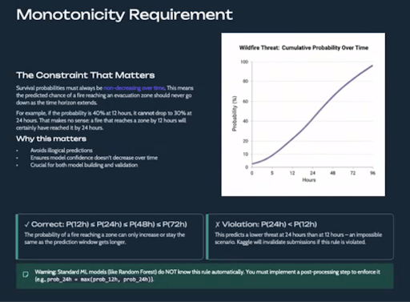

# Wildfire Structure-Threat Survival Modeling — WiDS Datathon 2026

> Survival-analysis ensemble that predicts *when* a wildfire will threaten a structure.
> **2nd place** on the private leaderboard — team `btt_mapping`.


-success)


---

## The Problem

Given a wildfire and a nearby structure, predict the **probability the structure survives** at four
time horizons: **12h, 24h, 48h, 72h**. This is a *survival / time-to-event* problem, not a simple
classification: predictions must be calibrated probabilities **and** correctly rank fires by risk,
**and** stay monotonic across horizons.

The competition is scored on a hybrid metric:

```
Hybrid = 0.3 · C-index  +  0.7 · (1 − WBS)
WBS    = 0.3 · BS@24h  +  0.4 · BS@48h  +  0.3 · BS@72h     (BS = Brier score)
```

**Why it's hard — the data is tiny and adversarial:**
- 221 training fires, 95 test fires.
- Only **69 "close" fires** (within 5000 m of a structure) carry timing signal — and *all 69 are
  event=1*. The 152 far fires are all event=0.
- The score is effectively decided by how well you rank and calibrate just **28 test close fires**.
- **89% of test close fires are static** (zero closing speed) — so the timing signal is faint and
  every modeling choice risks memorizing n=69.

This is a small-data discipline problem disguised as a modeling problem.

---

## Result

| | Score | Notes |
|---|---|---|
| **Private leaderboard** | **0.97272** | **2nd place**, team `btt_mapping` |
| Best public leaderboard | 0.97458 | `V28_seed_avg` (the model shipped here) |
| Out-of-fold (V28) | 0.9734 | C-index 0.9448 · WBS 0.0143 |

The shipped model (`model/wids_v28_best.ipynb`) is the V28 configuration that produced the best
public-LB score and underpins the 2nd-place private result.

---

## Approach — a two-stage survival ensemble

```
                     ┌──────────────────────────────────────────────┐
  221 fires ───────▶ │ STAGE 1 · Backbone                           │
                     │  RSF + GBM + Coxnet, 10-fold StratifiedKFold │
                     │  Nelder-Mead blend on the hybrid objective   │
                     │  (Coxnet anchors, ~0.78 weight)              │
                     └───────────────────────┬──────────────────────┘
                                             │  backbone survival curves
   69 close fires ──▶ ┌─────────────────────────────────────────────┐
                      │ STAGE 2 · Close-fire timing                 │
                      │  Coxnet (alpha=0.20, l1=0.5) on close fires │
                      │  7-fold KFold, averaged over 5 seeds        │
                      └──────────────────────┬──────────────────────┘
                                             │  timing-calibrated probs
                      ┌─────────────────────────────────────────────┐
                      │ STAGE 3 · Blend + calibrate                 │
                      │  mixed = (1−β)·backbone + β·close  (β≤0.60) │
                      │  Platt @12h/24h · isotonic @48h/72h         │
                      │  cummax → enforce monotonicity              │
                      └─────────────────────────────────────────────┘
```

Monotonicity (`P(12h) ≤ P(24h) ≤ P(48h) ≤ P(72h)` for every fire) is a hard requirement of the
metric and is asserted to have **zero violations** before any submission:



Full design rationale and the locked hyperparameters are in
**[`research/METHODOLOGY.md`](research/METHODOLOGY.md)**.

---

## What this project is really about: judgment, not just modeling

With only 69 close fires, **the leaderboard is the only unbiased judge** — high cross-validation scores
were repeatedly a *trap*. The bulk of the work was distinguishing genuine improvements from overfitting:

- **OOF-vs-LB calibration.** Genuine bias fixes amplify 3–5× on the LB; variance reductions amplify
  ~0.4×; overfit "improvements" amplify *negatively and catastrophically*.
- **Ideas that looked great and were killed by the LB:**
  - RSF on the 69 close fires (OOF 0.9738 → **LB 0.96426**, memorized n=69).
  - Loosening L1 to `l1_ratio=0.3` (OOF +0.0002 → **LB −0.00278**).
  - Feature selection on the close fires (leakage → **LB −0.005**).
  - k-NN timing with k=3 (OOF +0.0009 → **LB −0.01146**, the worst regression of the project).
- **Locked decisions with rationale** (distance threshold, `alpha`/`l1_ratio`, `beta ≤ 0.60`,
  Platt-vs-isotonic per horizon) — see [`research/METHODOLOGY.md`](research/METHODOLOGY.md) and the full
  version history in [`docs/RESULTS.md`](docs/RESULTS.md).

---

## Repository layout

```
wids-2026-wildfire-survival/
├── README.md                     # you are here
├── LICENSE                       # MIT
├── requirements.txt              # pinned dependencies (Python 3.9)
├── SETTINGS.json                 # all input/output paths (single source of truth)
├── data/
│   └── README.md                 # how to obtain the Kaggle data (not redistributed)
├── model/                        # the shipped V28 solution
│   ├── wids_v28_best.ipynb       # end-to-end pipeline (train + predict)
│   ├── model_artifacts_v28.pkl   # serialized fitted models for inference-only use
│   └── ENTRY_POINTS.md           # how to run train vs. predict-only
├── submissions/                  # representative submissions tracing the LB story
│   ├── submission_v08_hybrid.csv         # 0.97090 — hybrid objective baseline
│   ├── submission_v15_two_stage.csv      # 0.97198 — two-stage timing introduced
│   ├── submission_v21_close_cox.csv      # 0.97438 — Coxnet timing (biggest jump)
│   ├── submission_v28_seed_avg.csv       # 0.97458 — best (shipped)
│   └── submission_v38_new_features.csv   # 0.97445 — feature experiment
├── research/
│   ├── EDA.ipynb                 # exploratory analysis
│   ├── METHODOLOGY.md            # architecture, what works / what fails, design rationale
│   ├── figures/
│   └── notebooks/                # curated pivotal versions of the model
│       ├── v01_baseline_rsf.ipynb
│       ├── v08_hybrid_objective.ipynb
│       ├── v15_two_stage_timing.ipynb
│       ├── v28_best.ipynb
│       └── v38_new_features.ipynb
└── docs/
    └── RESULTS.md                # results table, full version history, OOF-vs-LB analysis
```

---

## Reproducibility / Quickstart

**Environment** (Python 3.9 required — `scikit-survival` has known incompatibilities with 3.12+):

```bash
python3.9 -m venv .venv
source .venv/bin/activate
pip install -r requirements.txt
```

**Data** — not redistributed here (Kaggle competition data). Download `train.csv` and `test.csv` from
the WiDS Datathon 2026 Kaggle competition and place them in `data/`. See [`data/README.md`](data/README.md).
Paths are configured in `SETTINGS.json`; the defaults work out of the box once data is in `data/`.

**Train + predict (full pipeline, ~8–10 min on Apple M4):**

```bash
jupyter lab   # open and run all cells:
#   model/wids_v28_best.ipynb
```

This runs the entire pipeline end-to-end and writes `submission (V28_seed_avg).csv` plus a refreshed
`model_artifacts_v28.pkl`.

**Predict only (no retraining, ~5 s):** load the bundled `model/model_artifacts_v28.pkl` and run the
inference cells. See [`model/ENTRY_POINTS.md`](model/ENTRY_POINTS.md) for both paths and the artifact's
key schema.

---

## Team & contributions

Built by **Anjali Dev**, **Marcello Borromeo**, and **Swetha Upadrasta** (team `btt_mapping`)
for the WiDS Datathon 2026.

**My contributions (Marcello Borromeo):** I led the modeling effort end-to-end —
- Designed the two-stage survival architecture (backbone ensemble → close-fire Coxnet timing → beta blend + calibration).
- Built the close-fire timing model and the OOF-vs-LB validation discipline that drove every decision on the n=69 problem.
- Owned feature engineering, the Nelder-Mead hybrid-objective blend, per-horizon calibration, and the monotonicity enforcement.
- Ran the full experiment program (V1 → V28) and the diagnostics that distinguished genuine gains from overfitting.

---

## License

Released under the [MIT License](LICENSE).
